# Tradr — AI-Powered Investment Research Platform
## Engineering RFC & System Architecture Document

**Version:** 1.0  
**Status:** Draft  
**Authors:** Architecture Team  
**Date:** 2026-05-27

---

## Table of Contents

1. [High-Level Architecture](#section-1--high-level-architecture)
2. [Frontend System Design](#section-2--frontend-system-design)
3. [Backend System Design](#section-3--backend-system-design)
4. [AI System Design](#section-4--ai-system-design)
5. [Database Design](#section-5--database-design)
6. [Realtime Architecture](#section-6--realtime-architecture)
7. [Security & Compliance](#section-7--security--compliance)
8. [DevOps & Deployment](#section-8--devops--deployment)
9. [Scalability Planning](#section-9--scalability-planning)
10. [MVP Roadmap](#section-10--mvp-roadmap)
11. [Monorepo Structure](#section-11--monorepo-structure)
12. [API Design](#section-12--api-design)
13. [UI/UX Design Direction](#section-13--uiux-design-direction)
14. [TradingView Integration](#section-14--tradingview-integration)
15. [Risks & Challenges](#section-15--risks--challenges)
16. [Bonus: Stack Summary, Costs, Prompts & Schemas](#section-16--bonus-appendices)

---

## Executive Summary

**Tradr** is a SaaS AI investment research platform combining institutional-grade charting (TradingView), AI-powered analysis (Claude/GPT-4o), real-time market data, and portfolio tracking — delivered with a Bloomberg Terminal Lite UX optimized for retail traders and self-directed investors.

**Core value proposition:** AI explains *why* — not just what to buy/sell, but the full reasoning chain anchored in technicals, sentiment, and macro context.

**Target users:** Self-directed retail traders, active investors, RIAs managing small books.

**Monetization:** Freemium SaaS ($0 / $29 / $99 / $299/mo tiers).

---

## Section 1 — High-Level Architecture

### 1.1 System Overview

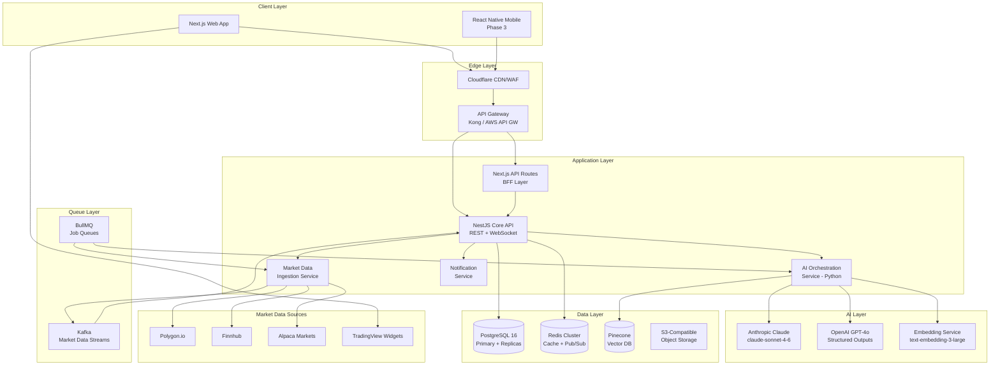

### 1.2 Deployment Topology

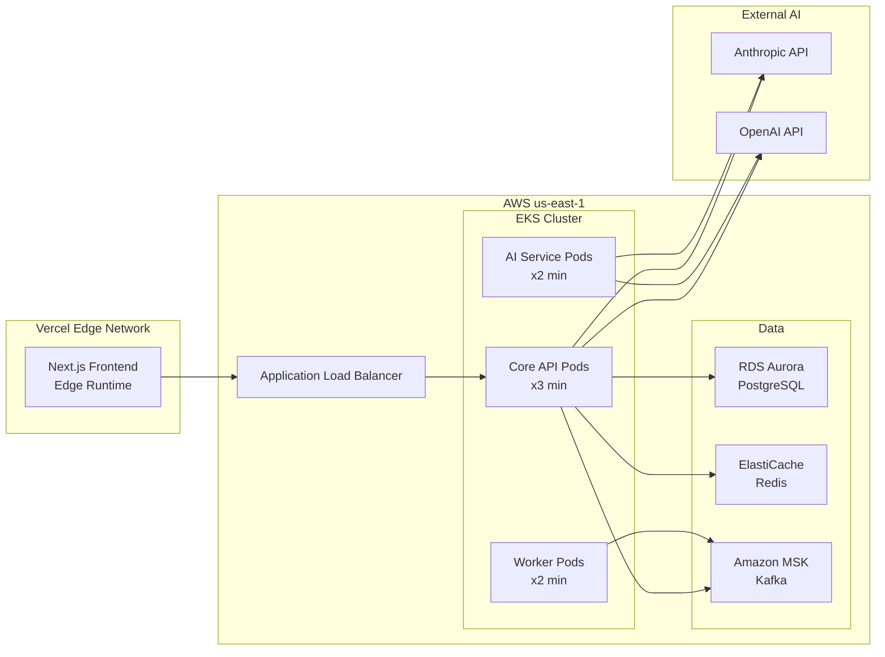

### 1.3 Data Flow Architecture

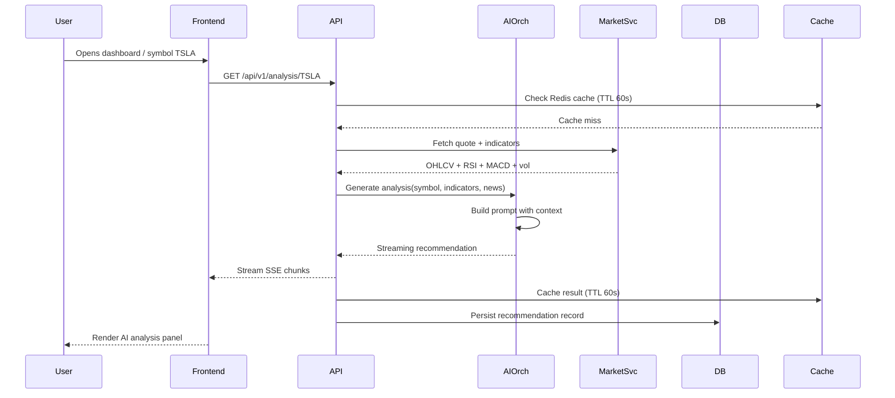

---

## Section 2 — Frontend System Design

### 2.1 Technology Choices

| Technology | Choice | Why |
|---|---|---|
| Framework | **Next.js 15 (App Router)** | RSC for data-heavy pages, streaming, SEO, API Routes as BFF |
| Language | **TypeScript 5.x** | Type safety across AI response schemas, financial data models |
| Styling | **Tailwind CSS v4** | Dark-mode-first, JIT, no runtime CSS-in-JS overhead |
| Components | **shadcn/ui + Radix** | Accessible primitives, fully owned, not a dep boundary |
| State (server) | **TanStack Query v5** | Caching, invalidation, optimistic updates, streaming queries |
| State (client) | **Zustand v5** | Minimal boilerplate, slice pattern, devtools |
| Charts | **TradingView Widgets + Lightweight Charts** | Official embeds for advanced, custom for portfolio charts |
| Auth | **Better Auth** (or Clerk) | Next.js native, social + JWT, org support |
| Forms | **React Hook Form + Zod** | Zero re-render validation, schema sharing with backend |
| Realtime | **Native WebSocket + reconnecting-websocket** | Quote streaming, AI chat streaming |
| Testing | **Vitest + Playwright** | Unit/integration + E2E |

### 2.2 Application Architecture

```mermaid
graph TD
    subgraph "Next.js App Router"
        ROOT[Root Layout<br/>Providers, Theme, Auth]
        DASH[/dashboard<br/>Dashboard Layout]
        CHART[/chart/[symbol]<br/>Chart Page - RSC]
        PORT[/portfolio<br/>Portfolio Page]
        WATCH[/watchlist<br/>Watchlist Page]
        CHAT[/assistant<br/>AI Chat Page]
        ADMIN[/admin<br/>Admin Panel]
    end

    subgraph "Client Components"
        TV_WIDGET[TradingViewWidget]
        AI_PANEL[AIRecommendationPanel]
        CHAT_UI[ChatInterface]
        QUOTE_TICKER[QuoteTicker]
        PORT_CHART[PortfolioChart]
    end

    subgraph "State"
        ZS[Zustand Store<br/>watchlist, layout, prefs]
        RQ[TanStack Query<br/>server data cache]
        WS_STORE[WS Store<br/>live quotes]
    end

    ROOT --> DASH
    DASH --> CHART
    DASH --> PORT
    DASH --> WATCH
    DASH --> CHAT
    CHART --> TV_WIDGET
    CHART --> AI_PANEL
    CHAT --> CHAT_UI
    DASH --> QUOTE_TICKER
    PORT --> PORT_CHART
    AI_PANEL --> RQ
    QUOTE_TICKER --> WS_STORE
    CHAT_UI --> ZS
```

### 2.3 State Management Pattern

```typescript
// stores/market.store.ts — Zustand slice pattern
interface MarketState {
  watchlist: string[];
  activeSymbol: string;
  quotes: Record<string, Quote>;
  layout: 'single' | 'dual' | 'quad';
  addToWatchlist: (symbol: string) => void;
  setActiveSymbol: (symbol: string) => void;
  updateQuote: (symbol: string, quote: Quote) => void;
}

// stores/ai.store.ts
interface AIState {
  chatHistory: ChatMessage[];
  streamingMessage: string | null;
  recommendations: Record<string, AIRecommendation>;
  isAnalyzing: boolean;
  appendStream: (chunk: string) => void;
  finalizeMessage: (message: ChatMessage) => void;
}
```

### 2.4 Responsive Strategy

- **Desktop (≥1440px):** Full multi-panel layout — sidebar + chart + AI panel + watchlist
- **Tablet (768–1439px):** Collapsible sidebar, stacked chart + AI panel
- **Mobile (Phase 3):** React Native app; web falls back to single-panel with bottom nav

CSS approach: Tailwind container queries (`@container`) over media queries where possible to make panels self-responsive when layout shifts.

### 2.5 Authentication Flow

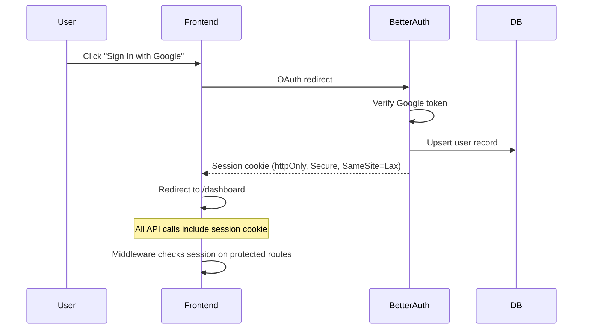

---

## Section 3 — Backend System Design

### 3.1 Service Architecture

The backend follows a **modular monolith → microservices** migration path. Phase 1 ships a single NestJS application with clear module boundaries. Modules are extracted to independent services as load demands.

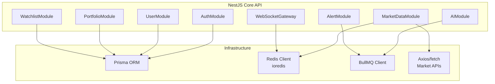

### 3.2 REST API Design

All endpoints follow REST conventions with versioning (`/api/v1/`). Rate limiting is applied at the API Gateway layer and enforced in-process via `nestjs-throttler`.

#### Core Route Groups

```
/api/v1/auth/**          — Auth (delegated to Better Auth)
/api/v1/users/**         — User profile, settings, subscription
/api/v1/market/**        — Quotes, candles, indicators, news, movers
/api/v1/analysis/**      — AI recommendations per symbol
/api/v1/portfolio/**     — Portfolio CRUD, P&L, performance
/api/v1/watchlist/**     — Watchlist CRUD, scoring
/api/v1/chat/**          — AI chat sessions, history
/api/v1/alerts/**        — Price/indicator alerts
/api/v1/admin/**         — Internal admin (role-gated)
```

### 3.3 WebSocket Gateway

```typescript
// NestJS WebSocket Gateway with Redis pub/sub adapter
@WebSocketGateway({ namespace: '/ws', cors: true })
export class MarketGateway {
  // Events emitted to clients:
  // quote:update    — { symbol, price, change, changePercent, volume }
  // analysis:ready  — { symbol, recommendation, confidence }
  // alert:triggered — { alertId, symbol, condition, value }
  // chat:stream     — { sessionId, chunk, done }
}
```

Scaling: `@socket.io/redis-adapter` ensures all pods share pub/sub state. Sticky sessions NOT required.

### 3.4 Background Job Architecture (BullMQ)

| Queue | Jobs | Schedule |
|---|---|---|
| `market-data` | `fetchDailyCandles`, `fetchQuotes`, `syncWatchlistQuotes` | Every 1min during market hours |
| `ai-analysis` | `generateRecommendation`, `batchAnalyzeWatchlist` | On-demand + nightly |
| `alerts` | `evaluateAlerts`, `sendNotification` | Every 30s |
| `news` | `fetchNews`, `summarizeNews`, `embedNewsArticles` | Every 15min |
| `maintenance` | `cleanExpiredCache`, `archiveOldRecommendations` | Daily |

### 3.5 Market Data Ingestion Pipeline

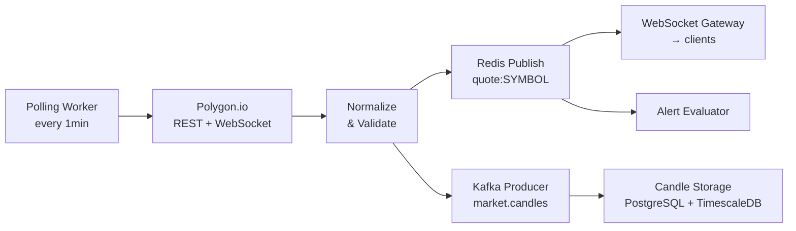

### 3.6 Market Data API Comparison

| Provider | Strengths | Weaknesses | Cost | Best For |
|---|---|---|---|---|
| **Polygon.io** | Excellent REST + WebSocket, options chain, full history, reliable | Paid for realtime | $29–$199/mo | Primary data source |
| **Finnhub** | Free tier generous, news/sentiment, crypto | Lower reliability, rate limits | Free–$50/mo | News + sentiment layer |
| **Alpaca Markets** | Free market data + brokerage integration | US equities only | Free | Paper trading integration |
| **TwelveData** | Good indicators API, WebSocket, Forex/Crypto | Can be slow under load | $0–$80/mo | Technical indicators |
| **Alpha Vantage** | Free, fundamentals | Very slow, strict rate limits | Free | Fundamentals only |
| **TradingView** | Best charts, not a data API | Widgets only, no data export | Widget: Free | Charting UI only |

**Recommendation:** Polygon.io (primary) + Finnhub (news/sentiment) + Alpaca (paper trading). Budget ~$80/mo at MVP scale.

### 3.7 Scaling Strategy

- **Stateless API pods** behind ALB — horizontal scale with `kubectl autoscale`
- **Read replicas** for PostgreSQL — route all SELECT queries via Prisma `$replica` client
- **Redis caching** at multiple layers: quote data (60s TTL), AI analysis (300s TTL), news summaries (900s TTL)
- **BullMQ concurrency** tuned per queue — market data workers can handle 50 concurrent jobs; AI workers capped at 10 (rate limit bound)

---

## Section 4 — AI System Design

### 4.1 Model Selection Matrix

| Task | Model | Reason | Latency | Cost/1M tokens |
|---|---|---|---|---|
| Deep symbol analysis | **Claude Sonnet 4.6** | Best reasoning, structured JSON, 200K context | ~3–8s | $3/$15 |
| Chat assistant | **Claude Sonnet 4.6** | Streaming, nuanced, financial literacy | ~1–3s TTFT | $3/$15 |
| Fast quote summaries | **Claude Haiku 4.5** | Sub-second, cheap, good enough for summaries | <1s | $0.25/$1.25 |
| Structured outputs | **GPT-4o** | Native JSON mode, reliable schema adherence | ~2–4s | $5/$15 |
| News embeddings | **text-embedding-3-large** | Best retrieval quality | ~200ms | $0.13/1M |
| Batch analysis (nightly) | **Claude Opus 4.7** | Highest quality, cost amortized overnight | ~10–20s | $15/$75 |

**Primary AI provider: Anthropic (Claude)**. OpenAI used as fallback and for structured output cases where schema adherence is critical.

### 4.2 Prompt Engineering Pipeline

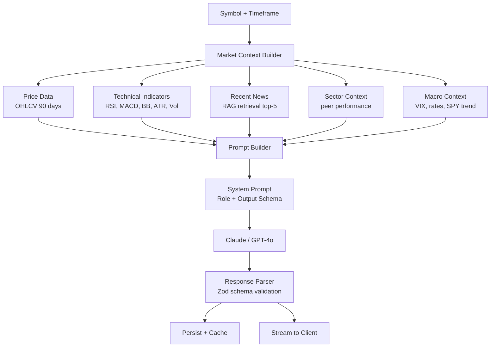

### 4.3 System Prompt — Recommendation Engine

```
You are a senior quantitative analyst with 20 years of experience at a top hedge fund.
You analyze securities using technical analysis, market sentiment, and macro context.

You MUST respond in valid JSON matching the schema provided.
You MUST explain your reasoning step by step before giving conclusions.
You MUST include uncertainty quantification — never present analysis as certain.
You MUST add a disclaimer that this is not financial advice.

Reasoning framework:
1. Trend Analysis — What is the primary trend? (price vs 20/50/200 MA)
2. Momentum — RSI, MACD signal direction and divergences
3. Volume — Is volume confirming price action?
4. Volatility — ATR context, Bollinger Band squeeze/expansion
5. News Sentiment — Bullish/bearish recent catalysts
6. Risk/Reward — Key support/resistance, stop placement
7. Synthesis — Weight all factors, assign confidence

Output your FULL reasoning in the `reasoning` field before populating recommendations.
```

### 4.4 AI Recommendation Output Schema

```typescript
interface AIRecommendation {
  symbol: string;
  timestamp: string;
  signal: 'STRONG_BUY' | 'BUY' | 'HOLD' | 'SELL' | 'STRONG_SELL';
  confidence: number;         // 0–100
  riskLevel: 'LOW' | 'MEDIUM' | 'HIGH' | 'VERY_HIGH';
  timeHorizon: 'INTRADAY' | 'SWING' | 'POSITION' | 'LONG_TERM';
  reasoning: string;          // Full chain-of-thought
  summary: string;            // 2-3 sentence plain English
  entryZone: { low: number; high: number };
  targetPrice: number;
  stopLoss: number;
  riskRewardRatio: number;
  positionSizeGuidance: string;
  keyRisks: string[];
  catalysts: string[];
  technicalFactors: {
    trend: string;
    momentum: string;
    volume: string;
    volatility: string;
  };
  disclaimer: string;
}
```

### 4.5 RAG Architecture for News

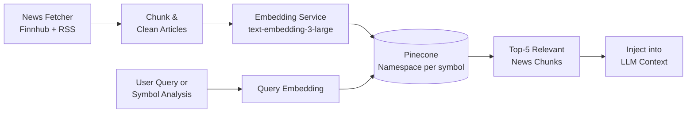

**Vector DB Strategy:**
- Pinecone namespace per symbol (`TSLA`, `NVDA`, etc.)
- Metadata filters: `{ publishedAt: { $gte: 7_days_ago } }`
- Embedding model: `text-embedding-3-large` (3072 dim)
- Upsert schedule: every 15 minutes during market hours

### 4.6 AI Chat Assistant — Multi-Turn Context

```typescript
interface ChatSession {
  sessionId: string;
  userId: string;
  messages: ChatMessage[];
  activeSymbol?: string;
  portfolioContext?: boolean;  // inject portfolio summary if true
}

// Context injection strategy:
// 1. Last 10 messages (rolling window)
// 2. Active symbol's latest recommendation
// 3. User's portfolio summary (if portfolioContext=true)
// 4. RAG-retrieved news for mentioned symbols
// 5. Current market overview (VIX, SPY, sector ETFs)
```

### 4.7 Multi-Agent Workflow (Phase 2)

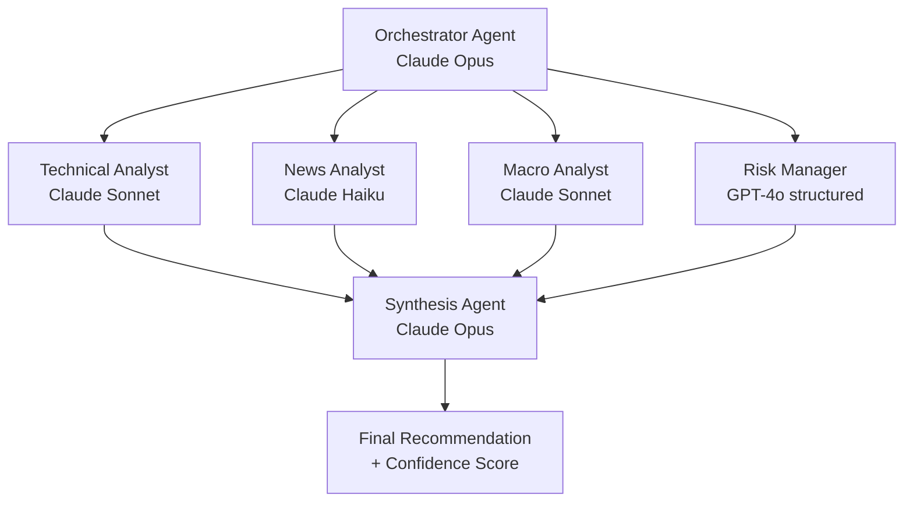

---

## Section 5 — Database Design

### 5.1 PostgreSQL Schema

```sql
-- Users and Auth
CREATE TABLE users (
  id          UUID PRIMARY KEY DEFAULT gen_random_uuid(),
  email       TEXT UNIQUE NOT NULL,
  name        TEXT,
  avatar_url  TEXT,
  tier        TEXT NOT NULL DEFAULT 'free', -- free|pro|premium|enterprise
  created_at  TIMESTAMPTZ DEFAULT NOW(),
  updated_at  TIMESTAMPTZ DEFAULT NOW()
);

CREATE TABLE subscriptions (
  id                UUID PRIMARY KEY DEFAULT gen_random_uuid(),
  user_id           UUID REFERENCES users(id) ON DELETE CASCADE,
  stripe_customer   TEXT UNIQUE,
  stripe_sub_id     TEXT UNIQUE,
  plan              TEXT NOT NULL,
  status            TEXT NOT NULL,         -- active|canceled|past_due
  current_period_end TIMESTAMPTZ,
  created_at        TIMESTAMPTZ DEFAULT NOW()
);

-- Portfolios and Holdings
CREATE TABLE portfolios (
  id          UUID PRIMARY KEY DEFAULT gen_random_uuid(),
  user_id     UUID REFERENCES users(id) ON DELETE CASCADE,
  name        TEXT NOT NULL,
  description TEXT,
  currency    TEXT DEFAULT 'USD',
  is_paper    BOOLEAN DEFAULT FALSE,        -- paper trading flag
  created_at  TIMESTAMPTZ DEFAULT NOW()
);

CREATE TABLE holdings (
  id            UUID PRIMARY KEY DEFAULT gen_random_uuid(),
  portfolio_id  UUID REFERENCES portfolios(id) ON DELETE CASCADE,
  symbol        TEXT NOT NULL,
  asset_type    TEXT NOT NULL,             -- stock|etf|crypto|forex
  quantity      DECIMAL(18,8) NOT NULL,
  avg_cost      DECIMAL(18,4) NOT NULL,
  opened_at     TIMESTAMPTZ DEFAULT NOW(),
  closed_at     TIMESTAMPTZ,              -- null = open position
  notes         TEXT
);

CREATE TABLE transactions (
  id           UUID PRIMARY KEY DEFAULT gen_random_uuid(),
  portfolio_id UUID REFERENCES portfolios(id) ON DELETE CASCADE,
  holding_id   UUID REFERENCES holdings(id),
  type         TEXT NOT NULL,             -- buy|sell|dividend|split
  symbol       TEXT NOT NULL,
  quantity     DECIMAL(18,8) NOT NULL,
  price        DECIMAL(18,4) NOT NULL,
  fees         DECIMAL(18,4) DEFAULT 0,
  executed_at  TIMESTAMPTZ DEFAULT NOW()
);

-- Watchlists
CREATE TABLE watchlists (
  id         UUID PRIMARY KEY DEFAULT gen_random_uuid(),
  user_id    UUID REFERENCES users(id) ON DELETE CASCADE,
  name       TEXT NOT NULL,
  is_default BOOLEAN DEFAULT FALSE,
  created_at TIMESTAMPTZ DEFAULT NOW()
);

CREATE TABLE watchlist_items (
  id           UUID PRIMARY KEY DEFAULT gen_random_uuid(),
  watchlist_id UUID REFERENCES watchlists(id) ON DELETE CASCADE,
  symbol       TEXT NOT NULL,
  asset_type   TEXT NOT NULL,
  position     INTEGER DEFAULT 0,         -- display order
  notes        TEXT,
  added_at     TIMESTAMPTZ DEFAULT NOW(),
  UNIQUE (watchlist_id, symbol)
);

-- AI Recommendations
CREATE TABLE ai_recommendations (
  id              UUID PRIMARY KEY DEFAULT gen_random_uuid(),
  symbol          TEXT NOT NULL,
  signal          TEXT NOT NULL,           -- STRONG_BUY|BUY|HOLD|SELL|STRONG_SELL
  confidence      SMALLINT NOT NULL,       -- 0-100
  risk_level      TEXT NOT NULL,
  time_horizon    TEXT NOT NULL,
  reasoning       TEXT NOT NULL,
  summary         TEXT NOT NULL,
  entry_low       DECIMAL(18,4),
  entry_high      DECIMAL(18,4),
  target_price    DECIMAL(18,4),
  stop_loss       DECIMAL(18,4),
  risk_reward     DECIMAL(6,2),
  model_id        TEXT NOT NULL,           -- claude-sonnet-4-6, etc.
  prompt_tokens   INTEGER,
  completion_tokens INTEGER,
  generated_at    TIMESTAMPTZ DEFAULT NOW()
);
CREATE INDEX idx_rec_symbol_time ON ai_recommendations (symbol, generated_at DESC);

-- Market Snapshots (TimescaleDB hypertable)
CREATE TABLE market_snapshots (
  symbol      TEXT NOT NULL,
  ts          TIMESTAMPTZ NOT NULL,
  open        DECIMAL(18,4),
  high        DECIMAL(18,4),
  low         DECIMAL(18,4),
  close       DECIMAL(18,4),
  volume      BIGINT,
  vwap        DECIMAL(18,4),
  PRIMARY KEY (symbol, ts)
);
SELECT create_hypertable('market_snapshots', 'ts');

-- Chat History
CREATE TABLE chat_sessions (
  id         UUID PRIMARY KEY DEFAULT gen_random_uuid(),
  user_id    UUID REFERENCES users(id) ON DELETE CASCADE,
  title      TEXT,
  created_at TIMESTAMPTZ DEFAULT NOW(),
  updated_at TIMESTAMPTZ DEFAULT NOW()
);

CREATE TABLE chat_messages (
  id           UUID PRIMARY KEY DEFAULT gen_random_uuid(),
  session_id   UUID REFERENCES chat_sessions(id) ON DELETE CASCADE,
  role         TEXT NOT NULL,             -- user|assistant|system
  content      TEXT NOT NULL,
  symbols      TEXT[],                    -- mentioned symbols
  model_id     TEXT,
  tokens_used  INTEGER,
  created_at   TIMESTAMPTZ DEFAULT NOW()
);
CREATE INDEX idx_chat_session ON chat_messages (session_id, created_at);

-- Alerts
CREATE TABLE alerts (
  id            UUID PRIMARY KEY DEFAULT gen_random_uuid(),
  user_id       UUID REFERENCES users(id) ON DELETE CASCADE,
  symbol        TEXT NOT NULL,
  condition     TEXT NOT NULL,            -- price_above|price_below|rsi_above|etc.
  threshold     DECIMAL(18,4) NOT NULL,
  is_active     BOOLEAN DEFAULT TRUE,
  triggered_at  TIMESTAMPTZ,
  notify_email  BOOLEAN DEFAULT TRUE,
  notify_push   BOOLEAN DEFAULT FALSE,
  created_at    TIMESTAMPTZ DEFAULT NOW()
);
CREATE INDEX idx_alerts_active ON alerts (symbol, is_active) WHERE is_active = TRUE;
```

### 5.2 Entity Relationship Diagram

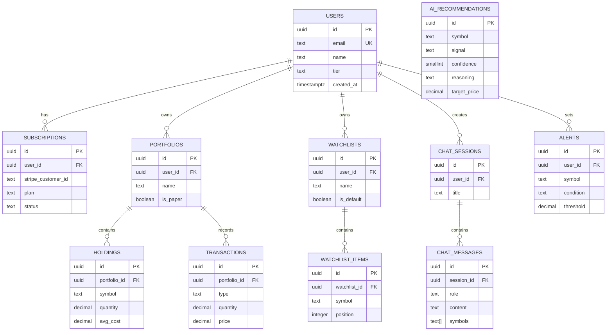

---

## Section 6 — Realtime Architecture

### 6.1 WebSocket Architecture

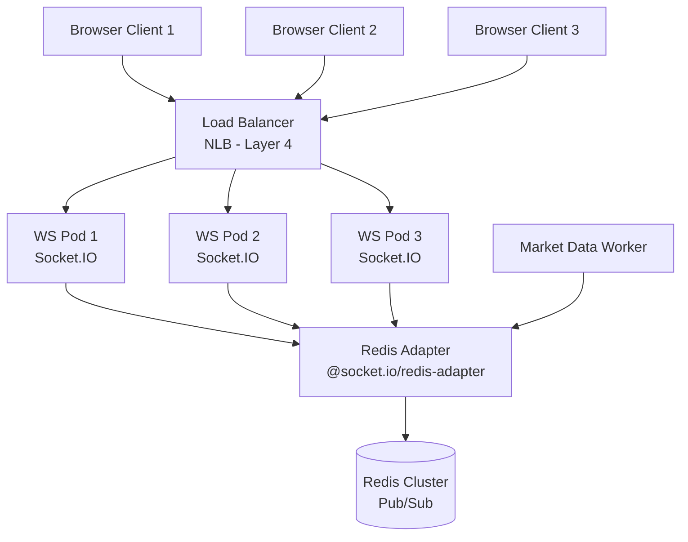

**Key design decisions:**
- Layer-4 NLB (not ALB) for WebSocket — avoids HTTP header overhead, supports long-lived connections
- Redis adapter means any pod can publish and all subscribed clients on any pod receive it
- Rooms per symbol: `room:quote:TSLA` — clients subscribe only to symbols in their watchlist
- Client reconnection: `reconnecting-websocket` library with exponential backoff

### 6.2 WebSocket Event Schema

```typescript
// Client → Server
interface ClientEvents {
  'subscribe:quotes': { symbols: string[] };
  'unsubscribe:quotes': { symbols: string[] };
  'subscribe:analysis': { symbol: string };
  'chat:message': { sessionId: string; content: string };
  'ping': {};
}

// Server → Client
interface ServerEvents {
  'quote:update': {
    symbol: string;
    price: number;
    change: number;
    changePercent: number;
    volume: number;
    ts: number;
  };
  'analysis:ready': {
    symbol: string;
    signal: string;
    confidence: number;
    summary: string;
  };
  'alert:triggered': {
    alertId: string;
    symbol: string;
    condition: string;
    value: number;
  };
  'chat:chunk': {
    sessionId: string;
    chunk: string;
    done: boolean;
  };
  'pong': {};
}
```

### 6.3 Market Hours Rate Limiting

```
Pre-market (4am–9:30am ET):  Poll every 5 minutes
Market hours (9:30am–4pm ET): Poll every 60 seconds (REST), WebSocket for active symbols
After-hours (4pm–8pm ET):     Poll every 5 minutes
Overnight:                    No polling; use previous close data
Crypto:                       24/7, every 60 seconds
```

### 6.4 AI Streaming via SSE

For AI recommendation generation and chat, use Server-Sent Events (SSE) for the initial HTTP stream, then hydrate WebSocket for subsequent updates:

```typescript
// Next.js API Route — streaming AI response
export async function GET(req: Request) {
  const stream = new ReadableStream({
    async start(controller) {
      const aiStream = await anthropic.messages.stream({
        model: 'claude-sonnet-4-6',
        messages: buildMessages(context),
        max_tokens: 2048,
      });
      for await (const chunk of aiStream) {
        controller.enqueue(encodeChunk(chunk));
      }
      controller.close();
    }
  });
  return new Response(stream, {
    headers: { 'Content-Type': 'text/event-stream' }
  });
}
```

---

## Section 7 — Security & Compliance

### 7.1 Authentication & Authorization

- **Auth:** Better Auth with Google/GitHub OAuth + magic link email
- **Sessions:** httpOnly + Secure + SameSite=Lax cookies; no localStorage token storage
- **JWT:** Short-lived access tokens (15min) + refresh tokens (7 days) stored server-side in Redis
- **RBAC:** Roles: `user`, `pro`, `admin` — enforced in NestJS Guards
- **API Keys:** User-generated API keys for programmatic access; stored as SHA-256 hashes, prefixed with `tradr_`

### 7.2 API Security

```
Rate Limiting:
  - Free:    100 req/hour AI endpoints, 1000 req/hour data
  - Pro:     1000 req/hour AI, 10000 req/hour data
  - Premium: 10000 req/hour AI, unlimited data

CORS: Allowlist of known origins only
Input validation: Zod schemas on all API inputs — reject unknown fields
SQL injection: Prisma parameterized queries only — no raw string interpolation
XSS: Content-Security-Policy headers; React DOM escaping
CSRF: Double-submit cookie pattern for state-changing requests
```

### 7.3 Secrets Management

```
AWS Secrets Manager — production secrets (DB passwords, API keys)
Doppler — developer secret sync (never .env files in CI)
Environment variable injection — Kubernetes Secrets → Pod env vars
Key rotation — scheduled Lambda rotates market data API keys monthly
```

### 7.4 Financial Compliance

- **Disclaimers:** Every AI-generated recommendation includes: *"This is not financial advice. Past performance does not guarantee future results."*
- **No investment advice:** Platform positioned as "research tool" not "investment advisor" — avoids RIA registration requirements
- **Data licensing:** Polygon.io non-display license covers app usage; raw data redistribution prohibited
- **User data:** GDPR/CCPA compliance — data export + deletion endpoints required at MVP
- **Audit logging:** All AI recommendations and user actions logged to append-only audit table

### 7.5 SOC2 Readiness Checklist

| Control | Implementation |
|---|---|
| Encryption at rest | RDS encryption + S3 SSE-S3 |
| Encryption in transit | TLS 1.3 everywhere; HSTS |
| Access logging | CloudTrail + Application audit log |
| Change management | PR-required merges, branch protection |
| Incident response | PagerDuty integration, runbooks in Notion |
| Vulnerability scanning | Dependabot + Snyk in CI |
| Penetration testing | Annual third-party pentest (Phase 2) |

---

## Section 8 — DevOps & Deployment

### 8.1 Infrastructure Overview

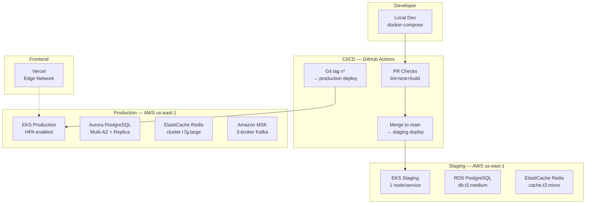

### 8.2 CI/CD Pipeline

```yaml
# .github/workflows/deploy.yml (abbreviated)
on:
  push:
    branches: [main]
  release:
    types: [published]

jobs:
  quality:
    steps:
      - uses: pnpm/action-setup@v3
      - run: pnpm lint
      - run: pnpm typecheck
      - run: pnpm test
      - run: pnpm build

  security:
    steps:
      - uses: snyk/actions/node@master
      - run: trivy image $IMAGE_TAG

  deploy-staging:
    needs: [quality, security]
    if: github.ref == 'refs/heads/main'
    steps:
      - run: helm upgrade --install tradr-staging ./charts/tradr
              --set image.tag=${{ github.sha }}
              --namespace staging

  deploy-production:
    needs: [quality, security]
    if: startsWith(github.ref, 'refs/tags/v')
    environment: production    # requires manual approval
    steps:
      - run: helm upgrade --install tradr-prod ./charts/tradr
              --set image.tag=${{ github.sha }}
              --namespace production
```

### 8.3 Observability Stack

| Layer | Tool | Purpose |
|---|---|---|
| Metrics | Prometheus + Grafana | Request rates, latency P99, queue depths |
| Logs | Loki + Grafana | Structured JSON logs, correlation IDs |
| Traces | OpenTelemetry → Tempo | Distributed tracing, AI call latency |
| Errors | Sentry | Frontend + backend error tracking |
| Uptime | Better Uptime | External endpoint monitoring |
| Alerts | PagerDuty | On-call routing |

### 8.4 Kubernetes Manifests Pattern

```yaml
# HPA for API pods
apiVersion: autoscaling/v2
kind: HorizontalPodAutoscaler
metadata:
  name: tradr-api
spec:
  minReplicas: 3
  maxReplicas: 20
  metrics:
    - type: Resource
      resource:
        name: cpu
        target:
          type: Utilization
          averageUtilization: 70
    - type: Pods
      pods:
        metric:
          name: websocket_connections
        target:
          type: AverageValue
          averageValue: "500"
```

---

## Section 9 — Scalability Planning

### 9.1 Scale Milestones

| Metric | 1K Users | 100K Users | 1M Users |
|---|---|---|---|
| Concurrent WebSocket | ~200 | ~20,000 | ~200,000 |
| API requests/sec | ~50 | ~5,000 | ~50,000 |
| AI calls/day | ~5,000 | ~500,000 | ~5,000,000 |
| DB reads/sec | ~500 | ~50,000 | ~500,000 |
| DB writes/sec | ~50 | ~5,000 | ~50,000 |
| Market data msgs/sec | ~100 | ~100 | ~1,000 |
| Infrastructure cost | ~$500/mo | ~$8,000/mo | ~$80,000/mo |

### 9.2 Scaling Architecture by Stage

**1K Users — Single EKS cluster, managed services:**
- 3× API pods (2 vCPU / 4GB each)
- 1× AI worker pod
- RDS `db.t3.large` (single AZ)
- ElastiCache `cache.t3.small`
- Total: ~$500/mo

**100K Users — Scaled cluster, read replicas, caching aggressive:**
- 8× API pods behind ALB
- 4× AI worker pods (queued, rate-limited to API limits)
- Aurora PostgreSQL Multi-AZ + 2 read replicas
- ElastiCache `r7g.large` cluster mode (3 shards)
- Kafka MSK for market data fan-out
- Pinecone scaled index
- Cloudflare R2 for static assets + news cache
- Total: ~$8,000/mo

**1M Users — Multi-region, database sharding:**
- Multi-region: us-east-1 (primary) + eu-west-1 (EU users)
- Aurora Global Database for cross-region reads
- Database sharding by user_id range on holdings/transactions
- Redis Cluster with 9+ shards
- Kafka with 12+ partitions per topic
- Dedicated AI inference cluster with request batching
- CDN edge caching of AI recommendations (low personalization)
- Total: ~$80,000/mo

### 9.3 Caching Strategy

```
Layer 1 — Cloudflare CDN (edge):
  - Static assets: 1 year
  - Market news summaries: 15 minutes
  - Public recommendation snapshots: 5 minutes

Layer 2 — Redis (application):
  - Live quotes: 15 seconds TTL
  - AI recommendations: 5 minutes TTL
  - News articles: 30 minutes TTL
  - Portfolio P&L: 60 seconds TTL
  - User session: 7 days TTL

Layer 3 — TanStack Query (client):
  - Quote data: staleTime 10s, gcTime 60s
  - Recommendations: staleTime 60s, gcTime 300s
  - Portfolio: staleTime 30s, gcTime 120s
```

### 9.4 AI Cost Optimization

- **Prompt caching:** Use Anthropic's prompt caching for system prompts — saves ~90% on repeated tokens
- **Tiered analysis:** Free users get Haiku analysis; Pro users get Sonnet; Premium get Opus nightly reports
- **Batching:** Nightly batch analysis for entire watchlists using Anthropic Batch API (50% cost reduction)
- **Cache aggressively:** Same-symbol recommendation valid for 5 minutes; served from Redis to all users watching that symbol
- **Context pruning:** Strip old news beyond 7 days; limit reasoning output tokens with `max_tokens`

---

## Section 10 — MVP Roadmap

### Phase 1 — MVP (Weeks 1–12, Team of 3)

**Goal:** Validate core value prop — AI-powered chart analysis with watchlists.

| Week | Milestone |
|---|---|
| 1–2 | Monorepo setup, auth, DB schema, CI/CD |
| 3–4 | TradingView widget integration, symbol search |
| 5–6 | Market data ingestion (Polygon), quote streaming |
| 7–8 | AI recommendation engine v1 (Sonnet, single symbol) |
| 9–10 | AI chat assistant, streaming responses |
| 11 | Watchlists, alerts (email), portfolio tracking v1 |
| 12 | Polish, performance, beta launch |

**MVP Feature Set:**
- [x] TradingView advanced chart
- [x] AI recommendation per symbol
- [x] AI chat assistant
- [x] Basic watchlist
- [x] Portfolio tracking (manual entry)
- [x] Real-time quotes (top 50 symbols)
- [x] Email alerts
- [ ] Payment/subscription (Phase 2)

### Phase 2 — Growth (Months 4–9, Team of 6)

- Stripe subscription integration
- Multi-agent AI analysis pipeline
- Advanced portfolio analytics + P&L curves
- Paper trading integration (Alpaca)
- Push notifications (web + mobile web)
- News feed with AI summaries
- Screener / stock scanner
- Social features (shared watchlists)
- Mobile-optimized web

### Phase 3 — Enterprise (Months 10–18, Team of 12)

- React Native mobile apps
- Multi-user team accounts / RIA features
- Custom AI model fine-tuning on financial data
- Options flow integration
- Institutional data feeds
- API access tier for quants
- Backtesting engine
- White-label offering

### Engineering Team Structure

| Phase | Team |
|---|---|
| MVP | 1× Full-stack (Next.js + NestJS), 1× AI/Python, 1× Founding engineer (DevOps + data) |
| Growth | +2× Frontend, +1× Backend, +1× ML/AI |
| Enterprise | +4× Product engineers, +1× Platform, +1× Security, +1× Data engineer |

---

## Section 11 — Monorepo Structure

```
tradr/
├── apps/
│   ├── web/                          # Next.js 15 frontend
│   │   ├── app/
│   │   │   ├── (auth)/
│   │   │   │   ├── login/page.tsx
│   │   │   │   └── signup/page.tsx
│   │   │   ├── (dashboard)/
│   │   │   │   ├── layout.tsx
│   │   │   │   ├── page.tsx          # Dashboard home
│   │   │   │   ├── chart/[symbol]/page.tsx
│   │   │   │   ├── portfolio/page.tsx
│   │   │   │   ├── watchlist/page.tsx
│   │   │   │   └── assistant/page.tsx
│   │   │   └── api/
│   │   │       ├── auth/[...better-auth]/route.ts
│   │   │       ├── analysis/[symbol]/route.ts  # SSE streaming
│   │   │       └── chat/route.ts               # SSE streaming
│   │   ├── components/
│   │   │   ├── charts/
│   │   │   │   ├── TradingViewWidget.tsx
│   │   │   │   └── PortfolioChart.tsx
│   │   │   ├── ai/
│   │   │   │   ├── RecommendationPanel.tsx
│   │   │   │   ├── ChatInterface.tsx
│   │   │   │   └── AnalysisStream.tsx
│   │   │   ├── market/
│   │   │   │   ├── QuoteTicker.tsx
│   │   │   │   └── MarketMovers.tsx
│   │   │   ├── portfolio/
│   │   │   └── ui/                   # shadcn components
│   │   ├── stores/
│   │   │   ├── market.store.ts
│   │   │   ├── ai.store.ts
│   │   │   └── ui.store.ts
│   │   ├── hooks/
│   │   │   ├── useWebSocket.ts
│   │   │   ├── useQuotes.ts
│   │   │   └── useAIStream.ts
│   │   └── lib/
│   │       ├── api-client.ts
│   │       └── utils.ts
│   │
│   ├── api/                          # NestJS core API
│   │   ├── src/
│   │   │   ├── modules/
│   │   │   │   ├── auth/
│   │   │   │   ├── users/
│   │   │   │   ├── market/
│   │   │   │   ├── portfolio/
│   │   │   │   ├── watchlist/
│   │   │   │   ├── ai/
│   │   │   │   ├── alerts/
│   │   │   │   └── websocket/
│   │   │   ├── jobs/                 # BullMQ workers
│   │   │   ├── prisma/
│   │   │   └── main.ts
│   │   └── Dockerfile
│   │
│   └── ai-service/                   # Python FastAPI AI orchestration
│       ├── app/
│       │   ├── routers/
│       │   │   ├── recommendations.py
│       │   │   └── chat.py
│       │   ├── services/
│       │   │   ├── prompt_builder.py
│       │   │   ├── market_context.py
│       │   │   ├── rag.py
│       │   │   └── embeddings.py
│       │   └── models/
│       │       └── recommendation.py
│       └── Dockerfile
│
├── packages/
│   ├── db/                           # Prisma schema + migrations
│   │   ├── prisma/
│   │   │   ├── schema.prisma
│   │   │   └── migrations/
│   │   └── index.ts
│   │
│   ├── types/                        # Shared TypeScript types
│   │   ├── src/
│   │   │   ├── market.types.ts
│   │   │   ├── ai.types.ts
│   │   │   ├── portfolio.types.ts
│   │   │   └── api.types.ts
│   │   └── package.json
│   │
│   ├── ui/                           # Shared UI components (shadcn base)
│   │   ├── src/components/
│   │   └── package.json
│   │
│   ├── config/                       # Shared ESLint, TS, Tailwind configs
│   │   ├── eslint/
│   │   ├── typescript/
│   │   └── tailwind/
│   │
│   └── market-utils/                 # Shared market data utilities
│       ├── src/
│       │   ├── indicators.ts         # RSI, MACD, BB calculations
│       │   ├── formatters.ts
│       │   └── validators.ts
│       └── package.json
│
├── infra/
│   ├── terraform/
│   │   ├── modules/
│   │   │   ├── eks/
│   │   │   ├── rds/
│   │   │   └── redis/
│   │   ├── staging/
│   │   └── production/
│   └── k8s/
│       ├── charts/tradr/
│       └── manifests/
│
├── turbo.json
├── pnpm-workspace.yaml
└── package.json
```

### Turborepo Pipeline

```json
// turbo.json
{
  "pipeline": {
    "build": {
      "dependsOn": ["^build"],
      "outputs": [".next/**", "dist/**"]
    },
    "test": {
      "dependsOn": ["^build"],
      "cache": false
    },
    "lint": {},
    "typecheck": {
      "dependsOn": ["^build"]
    },
    "dev": {
      "cache": false,
      "persistent": true
    }
  }
}
```

---

## Section 12 — API Design

### 12.1 REST Endpoints

```
Authentication
  POST   /api/v1/auth/signup
  POST   /api/v1/auth/signin
  POST   /api/v1/auth/signout
  GET    /api/v1/auth/session

Market Data
  GET    /api/v1/market/quote/:symbol
  GET    /api/v1/market/candles/:symbol?timeframe=1D&from=&to=
  GET    /api/v1/market/search?q=TSLA
  GET    /api/v1/market/movers?type=gainers&limit=10
  GET    /api/v1/market/news/:symbol?limit=20
  GET    /api/v1/market/indicators/:symbol?indicators=RSI,MACD

AI Analysis
  GET    /api/v1/analysis/:symbol              → SSE stream
  GET    /api/v1/analysis/:symbol/latest       → cached recommendation
  GET    /api/v1/analysis/batch?symbols=TSLA,NVDA,AAPL

Chat
  GET    /api/v1/chat/sessions
  POST   /api/v1/chat/sessions
  GET    /api/v1/chat/sessions/:id/messages
  POST   /api/v1/chat/sessions/:id/messages    → SSE stream
  DELETE /api/v1/chat/sessions/:id

Portfolio
  GET    /api/v1/portfolio
  POST   /api/v1/portfolio
  GET    /api/v1/portfolio/:id
  PUT    /api/v1/portfolio/:id
  DELETE /api/v1/portfolio/:id
  GET    /api/v1/portfolio/:id/holdings
  POST   /api/v1/portfolio/:id/holdings
  DELETE /api/v1/portfolio/:id/holdings/:holdingId
  GET    /api/v1/portfolio/:id/performance
  POST   /api/v1/portfolio/:id/transactions

Watchlist
  GET    /api/v1/watchlist
  POST   /api/v1/watchlist
  PUT    /api/v1/watchlist/:id
  DELETE /api/v1/watchlist/:id
  POST   /api/v1/watchlist/:id/items
  DELETE /api/v1/watchlist/:id/items/:symbol
  PATCH  /api/v1/watchlist/:id/items/reorder

Alerts
  GET    /api/v1/alerts
  POST   /api/v1/alerts
  PUT    /api/v1/alerts/:id
  DELETE /api/v1/alerts/:id
```

### 12.2 OpenAPI Schema Examples

```yaml
# POST /api/v1/alerts
requestBody:
  content:
    application/json:
      schema:
        type: object
        required: [symbol, condition, threshold]
        properties:
          symbol:
            type: string
            pattern: '^[A-Z]{1,5}$'
            example: TSLA
          condition:
            type: string
            enum: [price_above, price_below, rsi_above, rsi_below,
                   percent_change_above, percent_change_below]
          threshold:
            type: number
            example: 250.00
          notifyEmail:
            type: boolean
            default: true
          notifyPush:
            type: boolean
            default: false

# GET /api/v1/analysis/:symbol/latest response
response:
  200:
    content:
      application/json:
        schema:
          $ref: '#/components/schemas/AIRecommendation'
  429:
    description: Rate limit exceeded
    content:
      application/json:
        schema:
          properties:
            error: { type: string }
            retryAfter: { type: integer }
```

### 12.3 WebSocket Protocol

See Section 6.2 for the full event schema. Connection flow:

```
1. Client connects: wss://api.tradr.com/ws?token=<session_token>
2. Server validates session → assigns to user room
3. Client sends: { event: "subscribe:quotes", data: { symbols: ["TSLA","NVDA"] } }
4. Server adds client to room:quote:TSLA, room:quote:NVDA
5. Market worker publishes to Redis → all pods forward to subscribed clients
6. Client receives: { event: "quote:update", data: { symbol: "TSLA", price: 248.50, ... } }
```

### 12.4 GraphQL Consideration

**Recommendation: Skip GraphQL at MVP.** REST + WebSocket covers all use cases with less complexity. GraphQL becomes valuable in Phase 3 when:
- Mobile apps need flexible field selection
- Third-party API access tier is launched
- Multiple frontend surfaces with divergent data needs

When/if adopted: use **Pothos** (TypeScript-native schema builder) with **Yoga** server.

---

## Section 13 — UI/UX Design Direction

### 13.1 Design System

```
Color Palette (dark mode first):
  Background:   #0A0A0B (near-black)
  Surface:      #111113
  Border:       #1E1E24
  Muted:        #2A2A32
  Text primary: #F1F1F3
  Text muted:   #8888A0
  Accent blue:  #3B82F6  (interactive)
  Bull green:   #22C55E  (gains, buy)
  Bear red:     #EF4444  (losses, sell)
  Hold amber:   #F59E0B  (hold/neutral)
  AI purple:    #A855F7  (AI elements)

Typography:
  UI:           Inter (variable)
  Numbers/mono: JetBrains Mono (price data, code)

Spacing: 4px base unit grid
Border radius: 8px default, 4px compact
```

### 13.2 Dashboard Layout

```
┌─────────────────────────────────────────────────────────────────┐
│  TRADR    [Search symbols...]    Market: ▲ SPY  ▼ VIX  AI Chat │
├──────────┬──────────────────────────────────────┬──────────────┤
│          │                                      │              │
│Watchlist │     TradingView Advanced Chart       │  AI Analysis │
│          │                                      │  Panel       │
│ TSLA ▲2% │     [Full interactive chart with     │              │
│ NVDA ▲5% │      indicators, drawing tools,      │ Signal: BUY  │
│ AAPL ▼1% │      timeframe switcher]             │ Conf: 78%    │
│ MSFT ▲0% │                                      │ Risk: MEDIUM │
│ AMZN ▲3% │                                      │              │
│ GOOGL ▲1%│                                      │ [Reasoning]  │
│          │                                      │ Chain of     │
│ [+Add]   │                                      │ thought...   │
│          ├──────────────────────────────────────│              │
│          │ Technical Summary  │  Recent News    │ [Entry Zone] │
│          │ RSI: 58 (neutral)  │  • TSLA Q4...   │ $248–$252    │
│          │ MACD: bullish      │  • Musk says... │ Target: $285 │
│          │ BB: mid band       │  • Analyst...   │ Stop: $238   │
│          │                    │                 │              │
└──────────┴────────────────────┴─────────────────┴──────────────┘
```

### 13.3 AI Chat Panel

```
┌─────────────────────────────────────────────┐
│  AI Research Assistant          [New Chat]  │
├─────────────────────────────────────────────┤
│                                             │
│  ┌──────────────────────────────────────┐   │
│  │ You: Analyze TSLA momentum           │   │
│  └──────────────────────────────────────┘   │
│                                             │
│  ┌──────────────────────────────────────┐   │
│  │ 🤖 TSLA is showing strong bullish   │   │
│  │ momentum driven by...               │   │
│  │                                     │   │
│  │ **Technical Factors:**              │   │
│  │ • RSI at 62 — room to run           │   │
│  │ • MACD crossed bullish 3 days ago   │   │
│  │ • Volume 40% above average          │   │
│  │                                     │   │
│  │ **Risk:** Watch $242 support...     │   │
│  └──────────────────────────────────────┘   │
│                                             │
│  [Quick: Analyze | Bullish setups | News]   │
│  ┌─────────────────────────────────────┐    │
│  │ Ask anything about markets...   [↵] │    │
│  └─────────────────────────────────────┘    │
└─────────────────────────────────────────────┘
```

### 13.4 Portfolio View

- Performance curve chart (Lightweight Charts) vs SPY benchmark
- Holdings table with sparklines, P&L %, AI signal badge
- Allocation donut chart by sector
- Risk metrics: beta, sharpe ratio (Phase 2)

### 13.5 Mobile Adaptation

Phase 1 mobile: responsive single-column layout with bottom tab bar (Chart | Watchlist | AI | Portfolio). TradingView widget is touch-native. AI panel collapses to bottom sheet.

---

## Section 14 — TradingView Integration

### 14.1 Embedding Strategy

TradingView offers three levels of integration:

| Approach | Use Case | License | Cost |
|---|---|---|---|
| **Widget (iframe embed)** | Advanced Chart, Mini Chart, Ticker Tape | Free | $0 |
| **Charting Library** | Fully customized chart, custom data feeds | Commercial license | ~$5,000/yr+ |
| **Trading Platform** | Full brokerage UI integration | Enterprise | Custom |

**Recommendation for MVP:** Use the free **Advanced Chart Widget** (iframe). It includes all technical analysis tools, 100+ indicators, drawing tools, multi-timeframe, and real-time data from TradingView's own feed. Upgrade to the Charting Library in Phase 2 for custom data feeds.

### 14.2 Advanced Chart Widget Integration

```typescript
// components/charts/TradingViewWidget.tsx
'use client';
import { useEffect, useRef } from 'react';

interface TradingViewWidgetProps {
  symbol: string;
  theme?: 'dark' | 'light';
  interval?: string;
  height?: number;
}

export function TradingViewWidget({
  symbol,
  theme = 'dark',
  interval = 'D',
  height = 600,
}: TradingViewWidgetProps) {
  const containerRef = useRef<HTMLDivElement>(null);

  useEffect(() => {
    if (!containerRef.current) return;
    containerRef.current.innerHTML = '';

    const script = document.createElement('script');
    script.src = 'https://s3.tradingview.com/external-embedding/embed-widget-advanced-chart.js';
    script.async = true;
    script.innerHTML = JSON.stringify({
      autosize: true,
      symbol: symbol,
      interval: interval,
      timezone: 'America/New_York',
      theme: theme,
      style: '1',
      locale: 'en',
      enable_publishing: false,
      allow_symbol_change: true,
      calendar: false,
      hide_side_toolbar: false,
      withdateranges: true,
      save_image: false,
      studies: ['RSI@tv-basicstudies', 'MACD@tv-basicstudies'],
    });
    containerRef.current.appendChild(script);
  }, [symbol, theme, interval]);

  return (
    <div className="tradingview-widget-container" ref={containerRef}
         style={{ height }}>
      <div className="tradingview-widget-container__widget h-full" />
    </div>
  );
}
```

### 14.3 Watchlist Syncing

The TradingView widget is sandboxed in an iframe — direct JS communication is not available. Sync strategy:

- Maintain watchlist state in Zustand
- Re-instantiate the widget with the new symbol when the user clicks a watchlist item
- The widget's `allow_symbol_change` allows the user to search within the chart independently
- Use postMessage API if the Charting Library is adopted in Phase 2

### 14.4 Charting Library (Phase 2)

The Charting Library allows custom data feeds — enabling Polygon.io data instead of TradingView's feed, plus custom indicators, overlays, and full styling control. Requires:
1. Commercial license agreement with TradingView
2. Self-hosted JS bundle (not CDN)
3. UDF (Universal Data Feed) adapter implementation

```typescript
// Phase 2: Custom UDF data feed adapter
class PolygonDataFeed implements IDatafeedChartApi {
  async getBars(symbolInfo, resolution, from, to, onResult) {
    const candles = await polygonClient.getCandles(
      symbolInfo.ticker, resolution, from, to
    );
    onResult(candles.map(toTVBar), { noData: candles.length === 0 });
  }
  // + subscribeBars, unsubscribeBars, resolveSymbol, searchSymbols
}
```

### 14.5 Pine Script Considerations

Pine Script is TradingView-platform-specific — it cannot be executed outside TradingView. For custom indicator logic on the server side, implement equivalent calculations in TypeScript using the `technicalindicators` or `tulind` library.

---

## Section 15 — Risks & Challenges

### 15.1 Risk Matrix

| Risk | Severity | Likelihood | Mitigation |
|---|---|---|---|
| AI hallucinations in financial recommendations | Critical | High | Strict output schema validation; disclaimer on every output; ground in real data |
| Market data licensing violations | Critical | Medium | Only use licensed providers; no data redistribution; consult legal before launch |
| SEC/FINRA "investment advisor" classification | Critical | Low-Medium | Clear "research tool" positioning; disclaimers; avoid personalized advice |
| TradingView widget ToS changes | High | Low | Plan migration path to Charting Library; abstract widget component |
| API provider outages (Polygon) | High | Medium | Secondary provider (Finnhub/TwelveData) as fallback; graceful degradation |
| WebSocket scaling under load | Medium | Medium | Redis adapter tested to 100K connections; load test before launch |
| AI API cost overruns | High | Medium | Per-user rate limits; budget alerts; cache aggressively |
| User data breach | Critical | Low | Encryption everywhere; no financial credentials stored; SOC2 roadmap |
| Latency degradation for realtime data | Medium | Medium | TimescaleDB for time-series; Redis for hot data; benchmark <100ms target |
| AI reasoning errors during volatile markets | High | High | Timestamp all recommendations; show "last updated"; never auto-execute trades |

### 15.2 AI Hallucination Mitigation

```
1. Ground all analysis in real data — never let the LLM invent prices or indicators
2. Zod schema validation on every AI response — reject malformed outputs
3. Confidence score floor — do not display recommendations below 40% confidence
4. Mandatory disclaimer on every AI output block
5. Model disagreement detection — if Haiku and Sonnet disagree significantly, flag uncertainty
6. Human-readable reasoning required — users can see WHY and judge themselves
7. Audit trail — log all prompts and responses for review
```

### 15.3 Legal / Regulatory Risks

- **Not an RIA:** Platform must clearly be a "research and information tool" — no personalized investment advice, no client solicitation, no AUM management
- **Market data redistribution:** Polygon.io license is for display only; raw data cannot be cached and re-sold
- **GDPR:** EU users require data residency consideration (eu-west-1 region), cookie consent, right to deletion
- **Pattern Day Trader rules:** If paper trading is integrated, display PDT warnings for margin accounts

---

## Section 16 — Bonus Appendices

### A. Recommended Tech Stack Summary

| Layer | Technology | Rationale |
|---|---|---|
| Frontend | Next.js 15 (App Router) | RSC + streaming + API Routes |
| Styling | Tailwind CSS v4 | Zero-runtime, dark mode |
| Components | shadcn/ui + Radix | Accessible, owned code |
| Client State | Zustand v5 | Simple, performant |
| Server State | TanStack Query v5 | Best-in-class caching |
| Auth | Better Auth | Next.js native, flexible |
| Backend | NestJS + TypeScript | Modular, scalable, typed |
| ORM | Prisma | Type-safe, great DX |
| Database | PostgreSQL 16 + TimescaleDB | Time-series native |
| Cache | Redis 7 (ElastiCache) | Pub/sub + caching |
| Queue | BullMQ | Redis-native, reliable |
| Stream | Kafka (MSK) | Market data fan-out at scale |
| AI Primary | Anthropic Claude Sonnet 4.6 | Best reasoning, streaming |
| AI Fast | Claude Haiku 4.5 | Sub-second, cheap |
| AI Structured | GPT-4o | JSON schema adherence |
| Embeddings | text-embedding-3-large | Best retrieval quality |
| Vector DB | Pinecone | Managed, fast retrieval |
| Charts | TradingView Widget → Library | Phase 1 free, Phase 2 licensed |
| Market Data | Polygon.io + Finnhub | Complementary coverage |
| Paper Trading | Alpaca Markets | Free, REST + WebSocket |
| Infrastructure | AWS EKS + Vercel | Proven, scalable |
| IaC | Terraform + Helm | Reproducible infra |
| CI/CD | GitHub Actions | Integrated, free for public |
| Observability | Prometheus + Grafana + Sentry | Full stack coverage |
| Monorepo | Turborepo + pnpm | Fast, cache-aware |

### B. Estimated Monthly Infrastructure Costs

**MVP (1K users):**
| Service | Cost/mo |
|---|---|
| AWS EKS (3 t3.large nodes) | $180 |
| RDS PostgreSQL db.t3.large | $90 |
| ElastiCache r6g.large | $120 |
| Vercel Pro | $20 |
| Polygon.io Starter | $29 |
| Finnhub Free | $0 |
| Anthropic API (~$0.50/user/day) | $50 |
| OpenAI API (fallback) | $20 |
| Pinecone Starter | $70 |
| CloudWatch + monitoring | $30 |
| Misc (S3, ECR, networking) | $30 |
| **Total** | **~$640/mo** |

**Growth (100K users):**
| Service | Cost/mo |
|---|---|
| AWS EKS (12 m7g.xlarge nodes) | $1,800 |
| Aurora PostgreSQL Multi-AZ | $800 |
| ElastiCache r7g.large cluster | $600 |
| Amazon MSK (3-broker) | $400 |
| Vercel Enterprise | $400 |
| Polygon.io Professional | $199 |
| Anthropic API (~$0.30/user/day) | $9,000 |
| Pinecone Standard | $700 |
| Cloudflare Pro + R2 | $200 |
| Observability stack | $300 |
| **Total** | **~$14,400/mo** |

*At 100K users with $29/mo average subscription = $2.9M ARR. Infra COGS ~6%.*

### C. Suggested AI Prompts for Key Features

**Symbol Deep Analysis:**
```
You are a senior quantitative analyst. Analyze {{symbol}} given the following data:

PRICE DATA (90 days):
{{ohlcv_data}}

TECHNICAL INDICATORS:
- RSI(14): {{rsi}} 
- MACD: Signal {{macd_signal}}, Histogram {{macd_hist}}
- 20-day MA: {{ma20}}, 50-day MA: {{ma50}}, 200-day MA: {{ma200}}
- Bollinger Bands: Upper {{bb_upper}}, Lower {{bb_lower}}
- ATR(14): {{atr}} ({{atr_pct}}% of price)
- Volume vs 20d avg: {{volume_ratio}}x

RECENT NEWS (past 7 days):
{{news_context}}

SECTOR CONTEXT:
{{sector_etf}} is {{sector_change}} this week.
Peer performance: {{peer_comparison}}

Analyze step by step following this framework:
1. Primary trend (vs MAs)
2. Momentum (RSI + MACD)
3. Volume confirmation
4. Volatility context
5. News sentiment
6. Risk/reward setup

Output ONLY valid JSON matching this schema: {{schema}}
```

**Chat Assistant — Market Overview:**
```
You are an expert financial analyst and market commentator.
Current date: {{date}}

Market snapshot:
- SPY: {{spy_price}} ({{spy_change}})
- QQQ: {{qqq_price}} ({{qqq_change}})
- VIX: {{vix}} ({{vix_context}})
- DXY: {{dxy}}
- 10Y Treasury: {{tnx}}%

User portfolio (if applicable):
{{portfolio_summary}}

User question: {{user_message}}

Instructions:
- Be concise and direct
- Use plain English, not jargon (unless user demonstrates expertise)
- Format numbers clearly ($248.50, +2.3%)
- Always distinguish between analysis and speculation
- End with: "⚠️ This is not financial advice."
```

**News Summarization:**
```
Summarize the following news articles about {{symbol}} in 3 bullet points.
For each point: state the fact, then its likely market impact (bullish/bearish/neutral).
Be factual. Do not infer beyond what's stated.

Articles:
{{articles}}
```

### D. Suggested Database Indexes

```sql
-- Performance-critical indexes

-- Quotes and time-series
CREATE INDEX CONCURRENTLY idx_snapshots_symbol_ts
  ON market_snapshots (symbol, ts DESC);

-- AI recommendations lookup
CREATE INDEX CONCURRENTLY idx_rec_symbol_recent
  ON ai_recommendations (symbol, generated_at DESC)
  WHERE generated_at > NOW() - INTERVAL '24 hours';

-- Portfolio queries
CREATE INDEX CONCURRENTLY idx_holdings_portfolio
  ON holdings (portfolio_id, closed_at NULLS FIRST);

CREATE INDEX CONCURRENTLY idx_transactions_portfolio_date
  ON transactions (portfolio_id, executed_at DESC);

-- Chat history
CREATE INDEX CONCURRENTLY idx_chat_messages_session
  ON chat_messages (session_id, created_at DESC);

-- Alert evaluation (hot path, runs every 30s)
CREATE INDEX CONCURRENTLY idx_alerts_active_symbol
  ON alerts (symbol, is_active)
  WHERE is_active = TRUE;

-- Watchlist items (for batch quote fetch)
CREATE INDEX CONCURRENTLY idx_watchlist_items_list
  ON watchlist_items (watchlist_id, position);

-- User lookups
CREATE UNIQUE INDEX idx_users_email ON users (email);
CREATE INDEX CONCURRENTLY idx_subscriptions_user
  ON subscriptions (user_id, status);
```

### E. Caching Strategy Summary

```
Cache Key Patterns:
  quote:{symbol}              TTL: 15s   — Live price data
  quote:batch:{hash}          TTL: 15s   — Batch quote response
  analysis:{symbol}           TTL: 300s  — AI recommendation
  candles:{symbol}:{tf}:{date} TTL: 3600s — Historical candles (immutable)
  news:{symbol}               TTL: 900s  — News articles list
  news:summary:{symbol}       TTL: 1800s — AI news summary
  movers:{type}               TTL: 60s   — Market movers list
  indicators:{symbol}         TTL: 60s   — Technical indicators
  portfolio:pl:{id}           TTL: 60s   — Portfolio P&L calculation
  user:session:{token}        TTL: 604800 — 7 days, user session

Cache Invalidation:
  - Quote cache: auto-expire (no manual invalidation)
  - Analysis cache: invalidate on explicit user refresh or after market close
  - Portfolio P&L: invalidate on new transaction
  - News: background refresh job

Cache Warming:
  - On market open (9:30am ET): warm top 500 symbols' quotes
  - Nightly: pre-generate AI recommendations for all Pro+ watchlists
```

### F. WebSocket Event Schema (Complete)

```typescript
// Full event schema for WebSocket protocol v1

// ── Client → Server ──────────────────────────────────
type C2S =
  | { e: 'sub:quotes';    d: { symbols: string[] } }
  | { e: 'unsub:quotes';  d: { symbols: string[] } }
  | { e: 'sub:analysis';  d: { symbol: string } }
  | { e: 'unsub:analysis';d: { symbol: string } }
  | { e: 'chat:send';     d: { sessionId: string; content: string } }
  | { e: 'chat:stop';     d: { sessionId: string } }
  | { e: 'ping';          d: Record<never, never> }

// ── Server → Client ──────────────────────────────────
type S2C =
  | { e: 'quote:tick';    d: QuoteTick }
  | { e: 'analysis:done'; d: AnalysisDone }
  | { e: 'chat:chunk';    d: ChatChunk }
  | { e: 'chat:done';     d: ChatDone }
  | { e: 'alert:fire';    d: AlertFired }
  | { e: 'error';         d: { code: string; message: string } }
  | { e: 'pong';          d: { ts: number } }

interface QuoteTick {
  sym: string;      // symbol
  p: number;        // price
  c: number;        // change
  cp: number;       // change percent
  v: number;        // volume
  ts: number;       // unix ms
}

interface ChatChunk {
  sid: string;      // session id
  chunk: string;    // text delta
  done: boolean;
}
```

### G. CI/CD Pipeline Detail

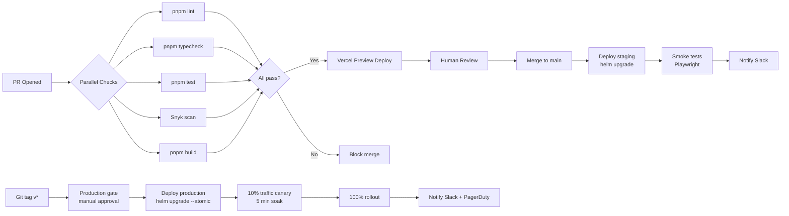

### H. Monetization Strategy

| Tier | Price | Target User | Key Features |
|---|---|---|---|
| **Free** | $0/mo | Curious retail investors | 3 watchlist items, delayed quotes (15min), Haiku AI (5 analyses/day), 1 portfolio |
| **Pro** | $29/mo | Active traders | Unlimited watchlist, realtime quotes, Sonnet AI (50 analyses/day), 5 portfolios, email alerts, news feed |
| **Premium** | $99/mo | Power traders | Everything in Pro + Opus nightly reports, 200 AI analyses/day, multi-chart layouts, paper trading, SMS alerts, portfolio analytics |
| **Enterprise** | $299/mo | RIAs, small funds | Everything + API access, team seats (5), custom AI personas, dedicated support, audit logs |

**Additional revenue streams:**
- **Affiliate / referral:** Alpaca brokerage referral — $50–$200 per funded account
- **Data insights (Phase 3):** Anonymized aggregate sentiment data sold to institutional buyers
- **Marketplace (Phase 3):** AI strategies / screeners created by power users, revenue share

**Growth levers:**
- Freemium → viral loop: share AI analysis links publicly (drive signups)
- Weekly AI market newsletter to email list (drives retention)
- Discord community for Pro+ users (reduces churn)

---

## Appendix: Sequence Diagrams

### AI Recommendation Generation Flow

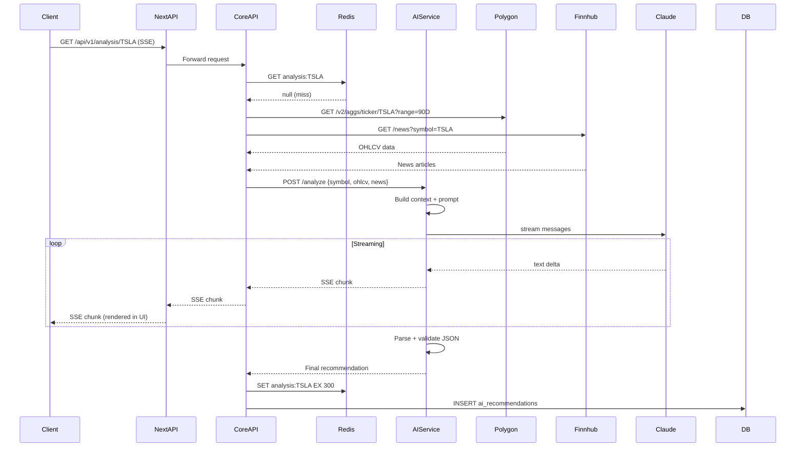

### User Alert Triggered Flow

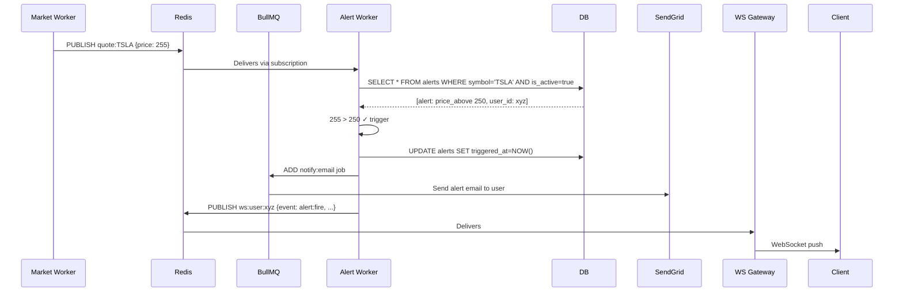

---

*End of Tradr Architecture RFC v1.0*

*This document is a living RFC. All estimates (costs, timelines, user counts) are approximations and should be validated against actual usage patterns. Nothing herein constitutes investment advice.*
